# Torque Titan & Monolith: The Project Lifecycle

Welcome to the engineering history of our autonomous sumobot platforms. This page tracks the design, prototyping, electrical systems, and hardware iterations under strict space, weight, and budgetary constraints.

---

## Chapter 1: The Drawn Boundary & Scavenged Parts

Our first challenge was navigating the school's procurement timeline. While waiting for parts to be ordered and approved, we needed to validate our physical envelope immediately to ensure we wouldn't fall behind schedule.

### 📐 Step 1: Initial Sizing & Manual Layout
Before opening CAD, I drew a literal 13cm x 13cm square on paper. Under supervision, I scavenged old wheels and parts from the lab storeroom to work backward from what we had on hand, ensuring the back radius of the wheels sat flush with the rear edge to maximize our wheelbase.

---

## Chapter 2: Silicon Architecture

With a basic physical footprint in mind, we shifted to evaluating our core electronics stack to understand our control capabilities before building a chassis.

### 🧠 Step 2: ESP32 Pin Mapping & Capabilities
We mapped out the pin assignments for the dual-core ESP32 to establish our sensor inputs and motor control outputs, focusing heavily on understanding the microcontroller's direct capabilities for power distribution.

---

## Chapter 3: Low-Fidelity Prototyping & Power Diagnostics

### 📦 Step 3: Cardboard Layout Validation & Motor Driver Diagnostics
We fabricated a rapid prototype entirely out of cardboard to mount the scavenged yellow TT motors and the ESP32. During initial bench testing under load, we diagnosed a massive drop in usable voltage across the board, proving our initial motor driver configuration needed optimization.
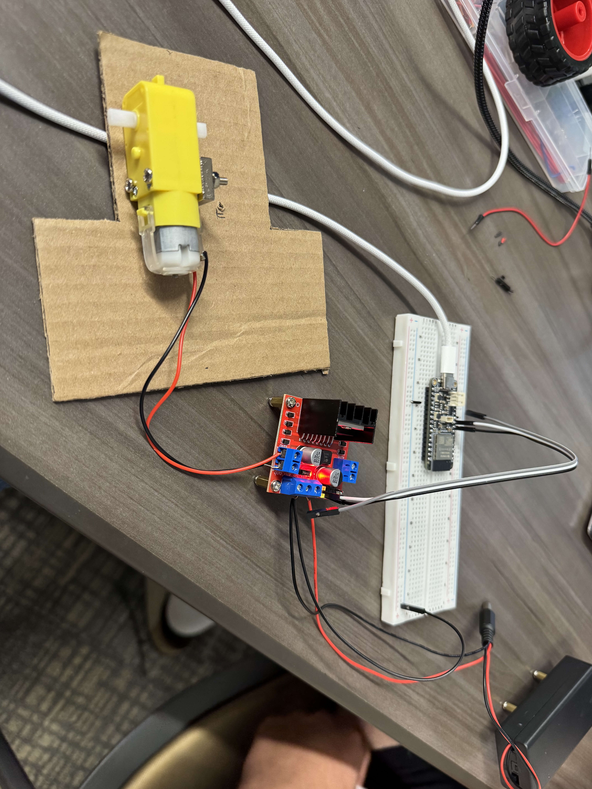

---

## Chapter 4: Drivetrain Scaling & Mechanical Clearance

### 🛞 Step 4: Wheel Sizing & Clearances
While the large diameter of our scavenged wheels gave us a great baseline, we utilized this phase to model the spatial layout for custom wheel sizing while planning a future pivot toward alternative materials.
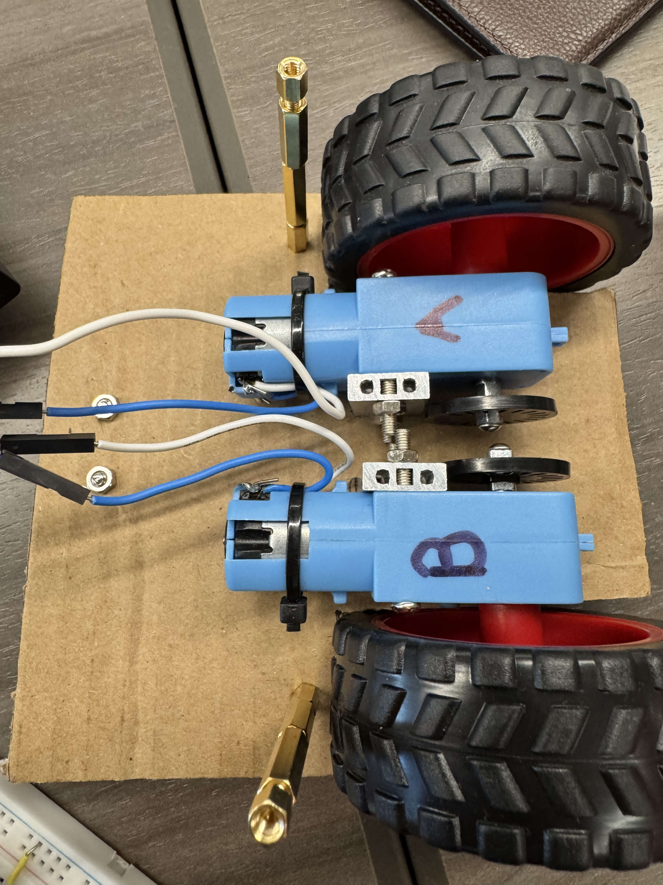

### ⚙️ Step 5: Motor Clearance & Scaling
Using standard L-shaped yellow TT motors, we evaluated side-by-side clearances within the chassis envelope, providing a baseline to plan future upgrades to high-power, straight-profile 25L metal gearmotors.
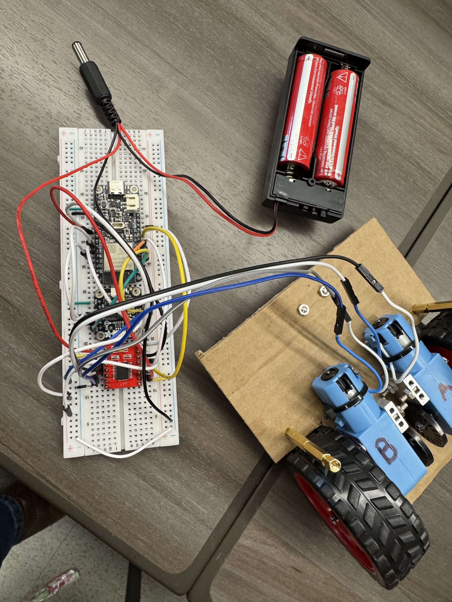

### 🛠️ Step 6: Hand-Cut Cardboard & Hardware Assembly
Before moving to software design, I fabricated the first structural geometric cage completely by hand out of heavy cardboard and real metal hardware to create a unified manual test frame.
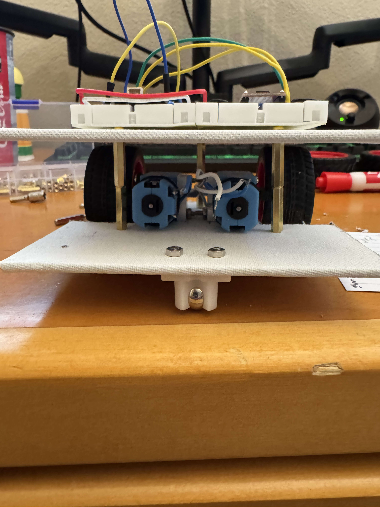

---

## Chapter 5: Digital Transition & Fabrication Realities

### 🖨️ Step 7: Initial Manufacturing Phase
We began translating our manual dimensions into physical plastic, initiating our very first 3D printing runs under the philosophy of *"Measure three times, print once."*
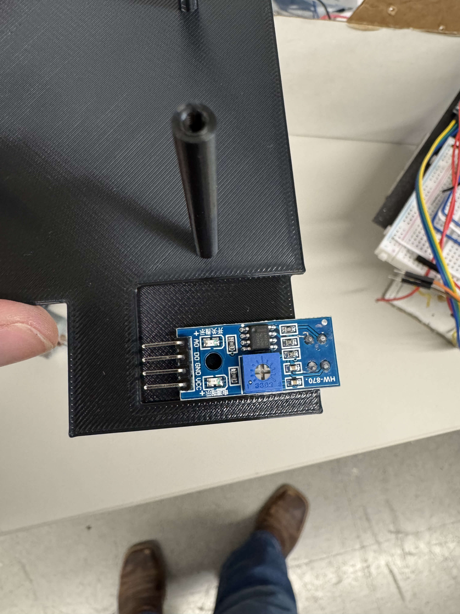

### 💻 Step 8: The CAD Learning Curve & Slicing Optimization
Immediately following our initial prints, we faced a steep learning curve with Fusion 360 and slicing profiles. We analyzed how print settings, shell counts, and infill configurations directly impact structural integrity, optimizing our parameters for future iterations.
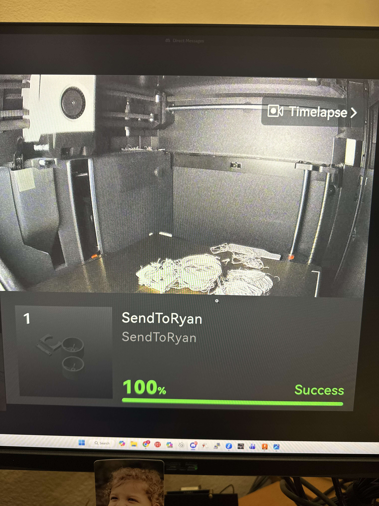

---

## Chapter 6: Spatial Tracking & Feedback Calibration

### 👁️ Step 9: Cardboard Sensor Positioning Mockup
To build an effective offensive capability, we had to ensure our sensors would never accidentally hit physical obstacles or structural ring blocks. We used a piece of hand-cut cardboard to mockup exactly where we wanted to mount the sensor arrays.
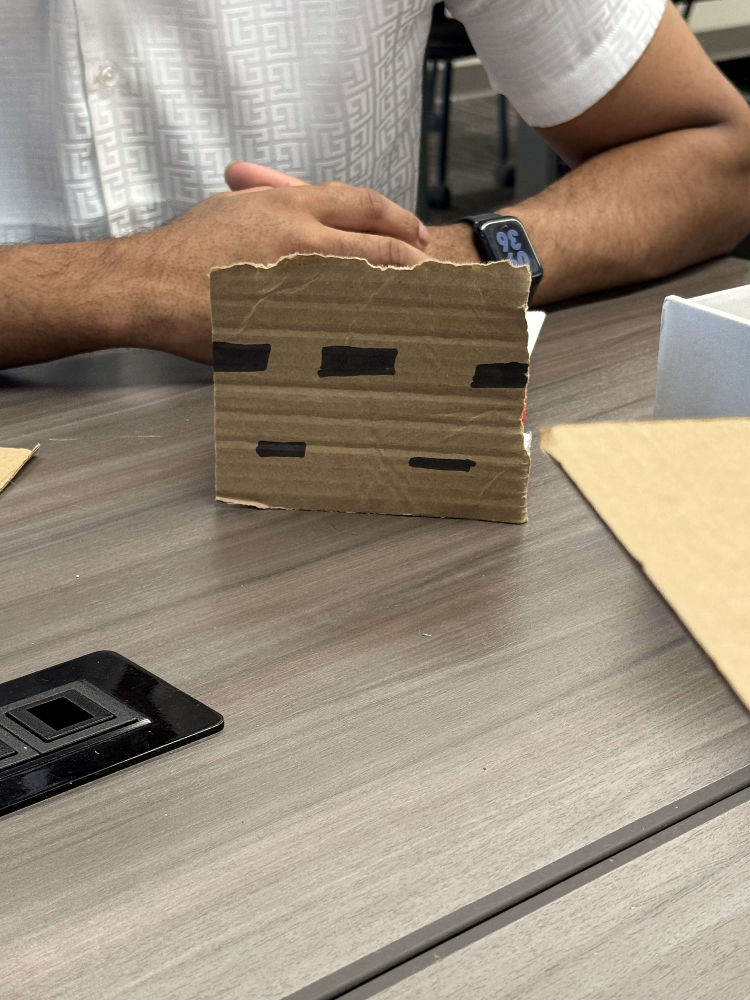

### 🏁 Step 10: Boundary Testing & Validation
With the sensor positioning layout established, we immediately moved to the arena floor to execute edge detection and boundary testing, ensuring our hardware configurations mapped correctly to real-world ring constraints.
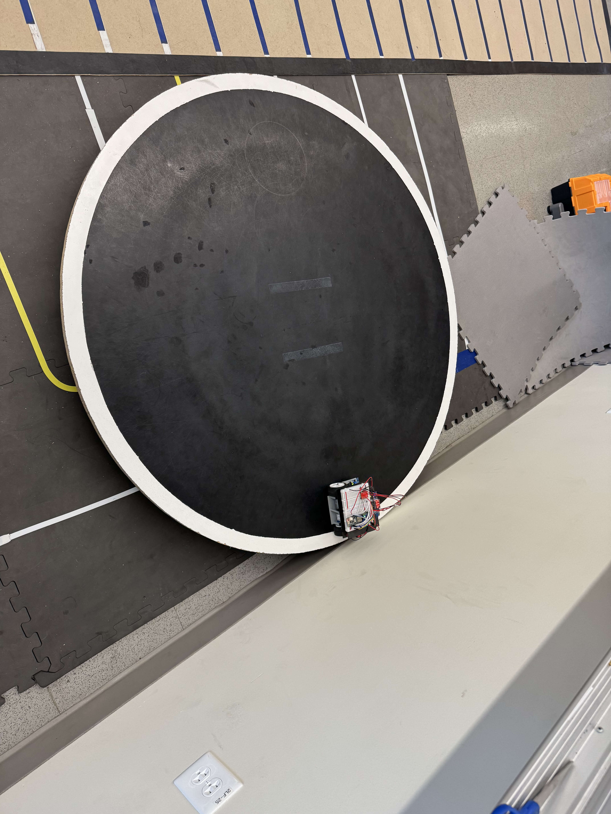

---

## Chapter 7: Advanced Materials & Tactical Upgrades

### 🧪 Step 11: Custom Wheel Molding & Urethane Chemistry
To maximize our coefficient of friction, we pivoted away from stock materials entirely. I designed and 3D printed a custom negative wheel mold, utilizing a kitchen scale to accurately mix 30A Shore hardness liquid polyurethane to cast our own ultra-high-traction tires.
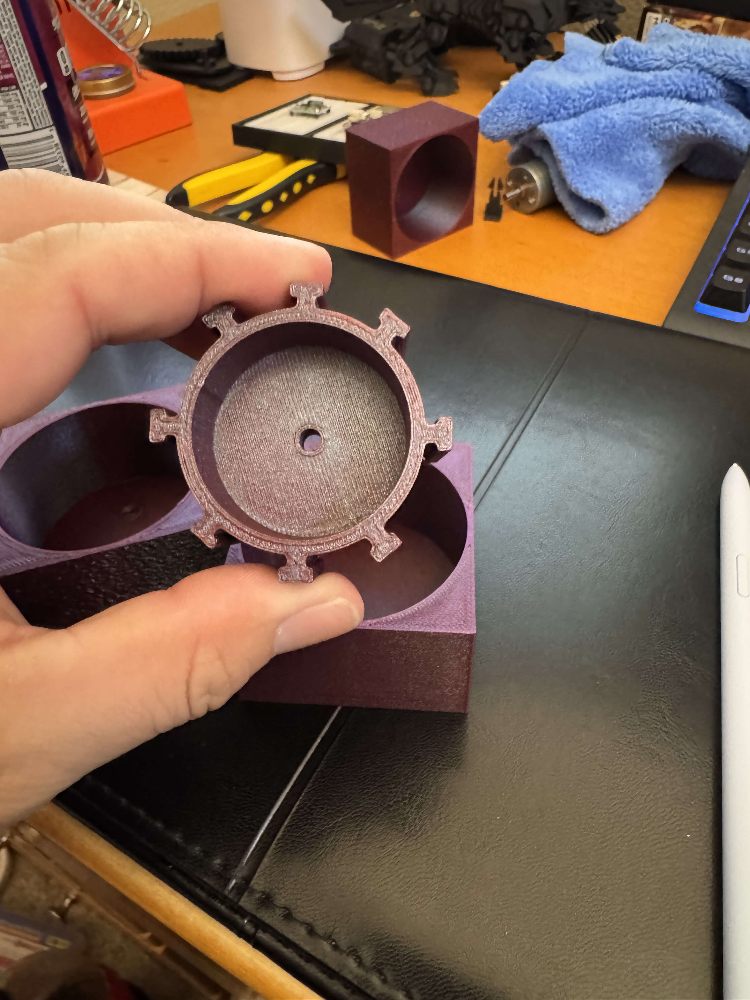
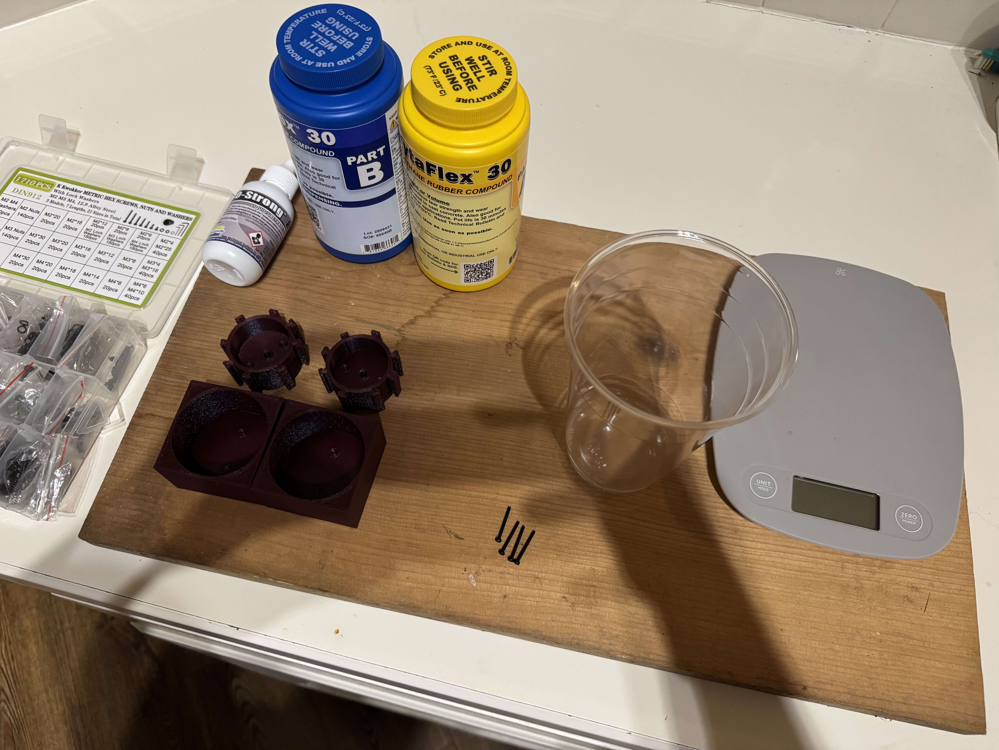

### 🏗️ Step 12: Layer Integration & Stability Testing
Rather than relying completely on custom prints, we added structural complexity by integrating a scavenged piece of 3D-printed material to serve as our second layer, subjecting the assembly to load testing.
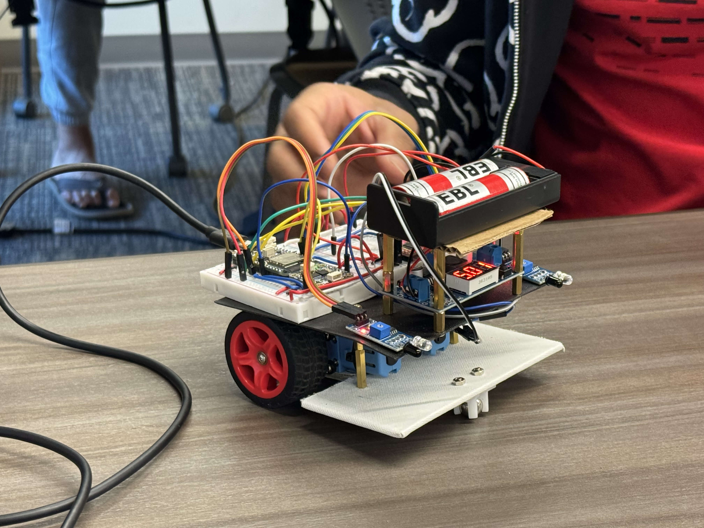

### 🛡️ Step 13: Tactical Mechanical Expansion (Expanding Shields)
To adapt to changing match dynamics and maximize defensive coverage, we engineered modular expanding shields. These components swing out to widen the robot's presence, deflecting opponent attacks. 

<!-- Masking container to crop out top/right background clutter on the side profile view -->
<!-- Masking container to aggressively crop out the top/right background clutter -->

    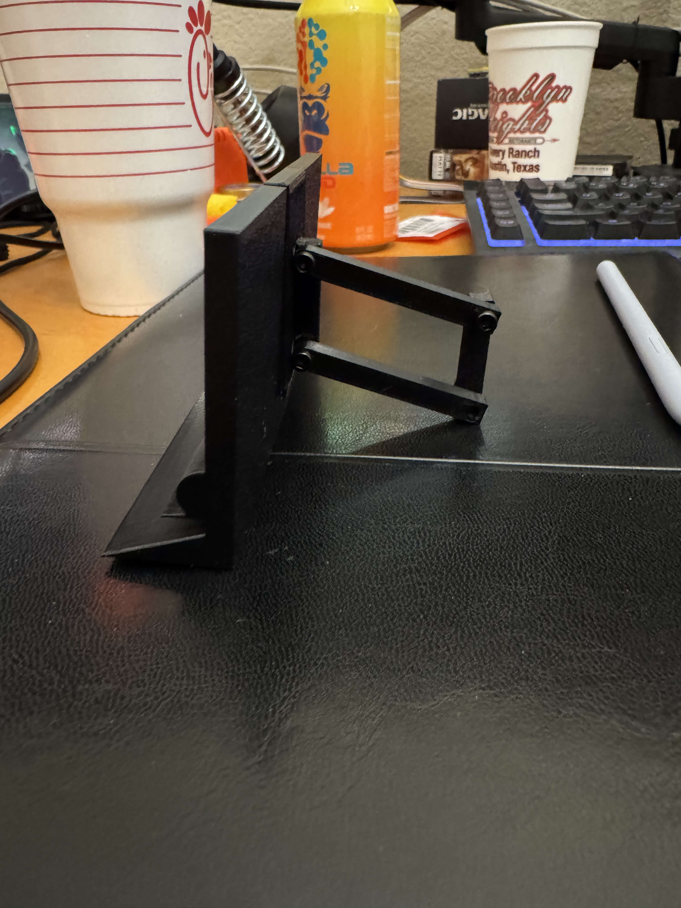

---

## Chapter 8: Fall 2025 Milestones & Next-Semester Evolution

### 📊 Step 14: Fall 2025 Design Day & The Monolith PCB Pivot
We capped off the semester by presenting our foundational progress and project management milestones at the Fall 2025 Design Day. With lessons learned regarding power drops, structural spacing, and custom casting, we finalized our roadmap for the upcoming semester: completely phasing out loose wiring harnesses by developing the dedicated, integrated Torque Titan control PCB.We also started looking at ideas for min-maxxing our robots capabilities. Below is a image of the Monoliths PCB Created by Bryan A where we swap out pins for object detection in favor of extra Motors for object pulling. 
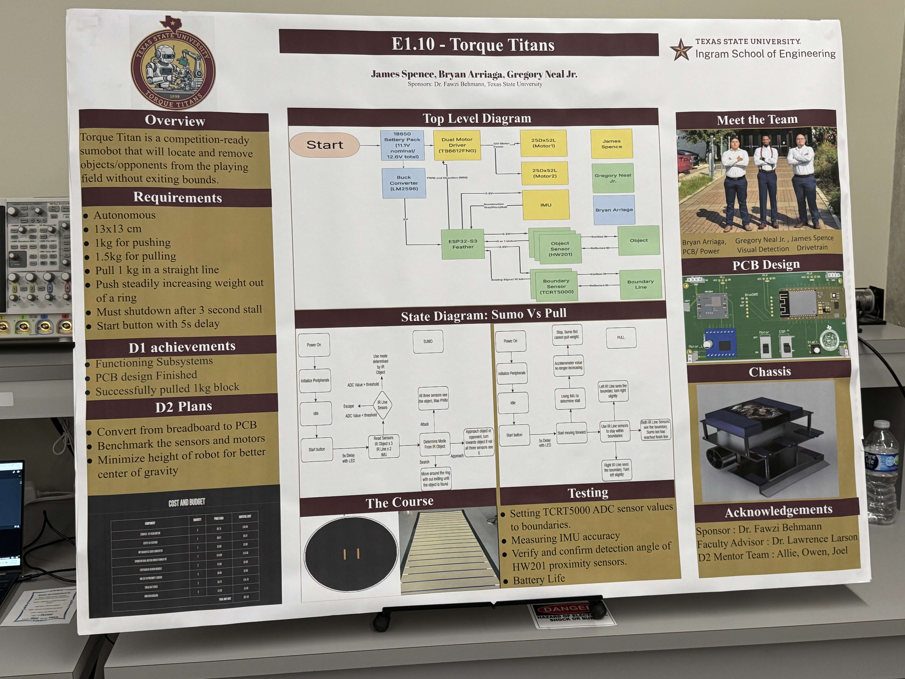
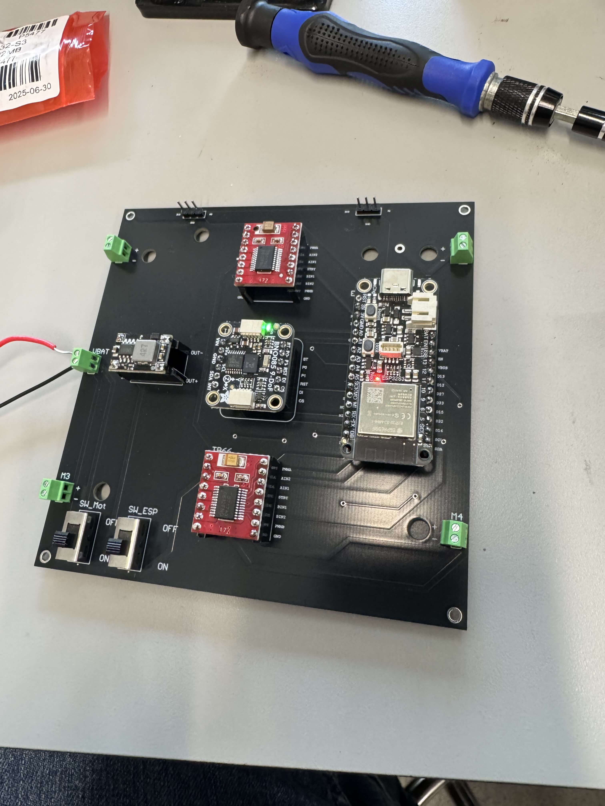
